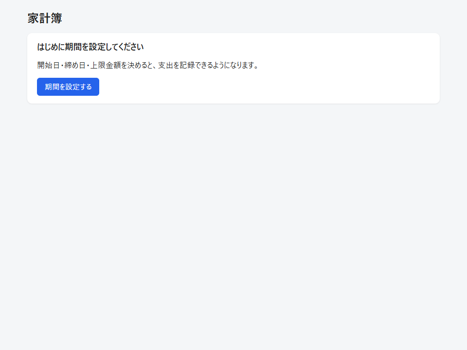
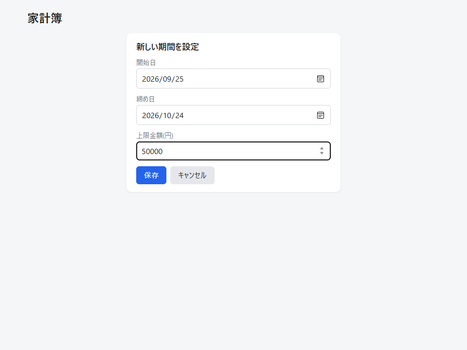
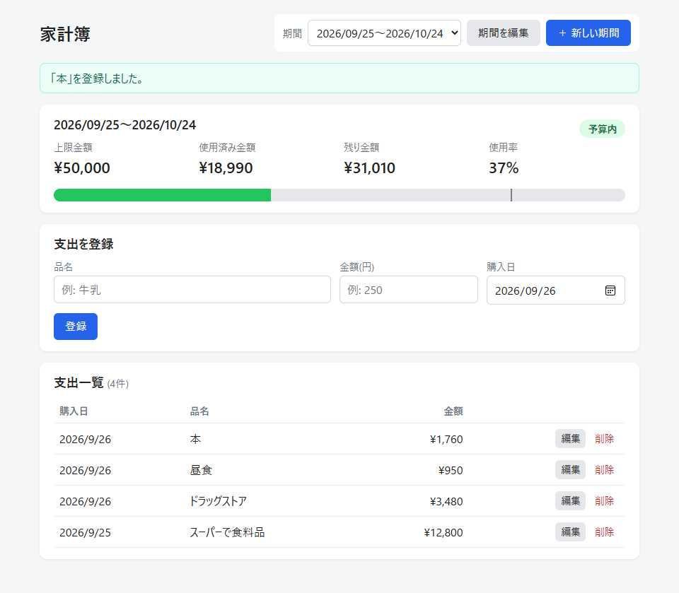
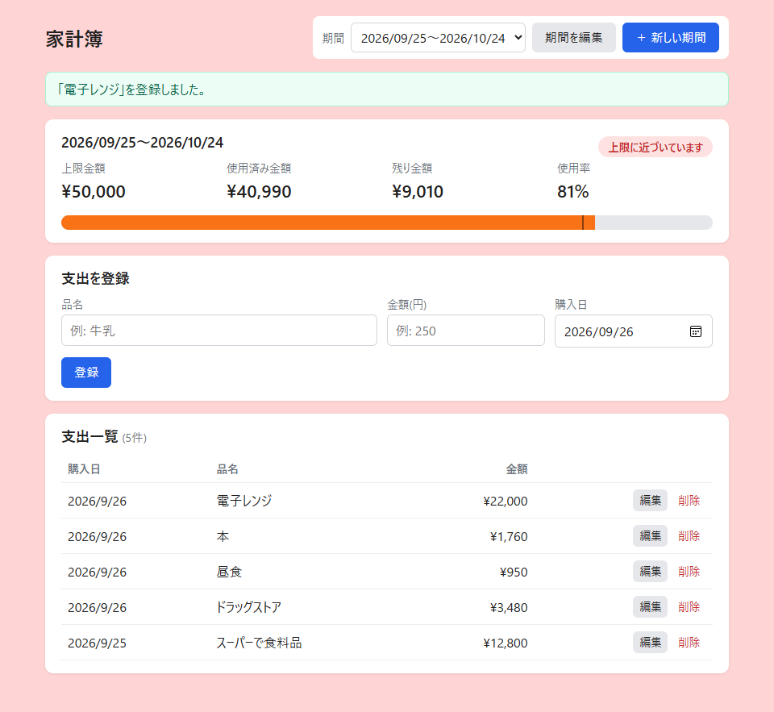
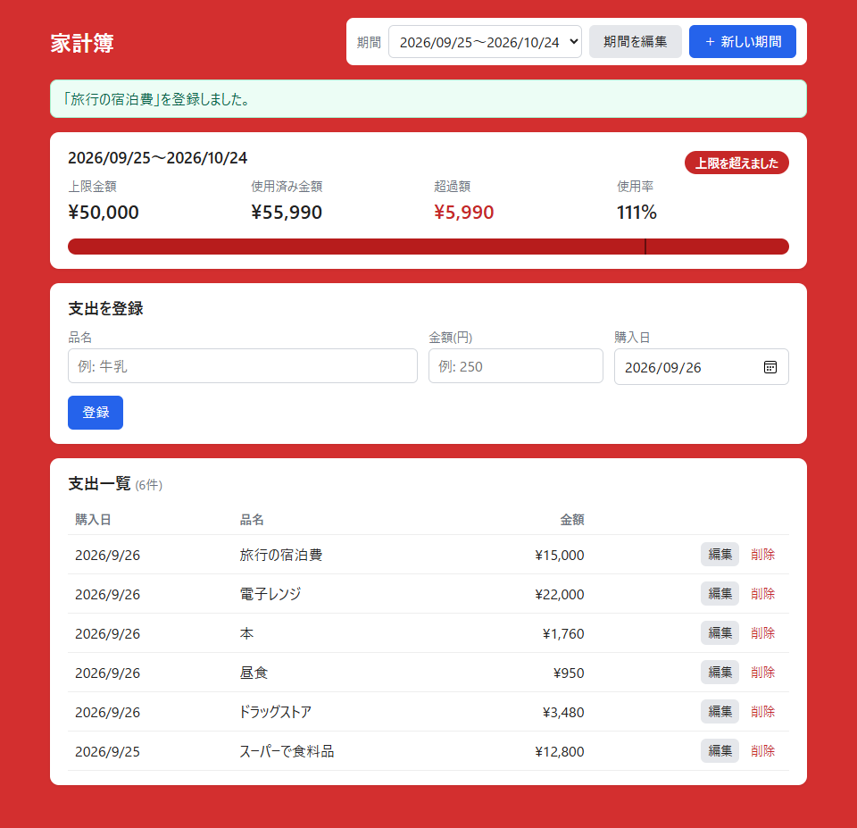
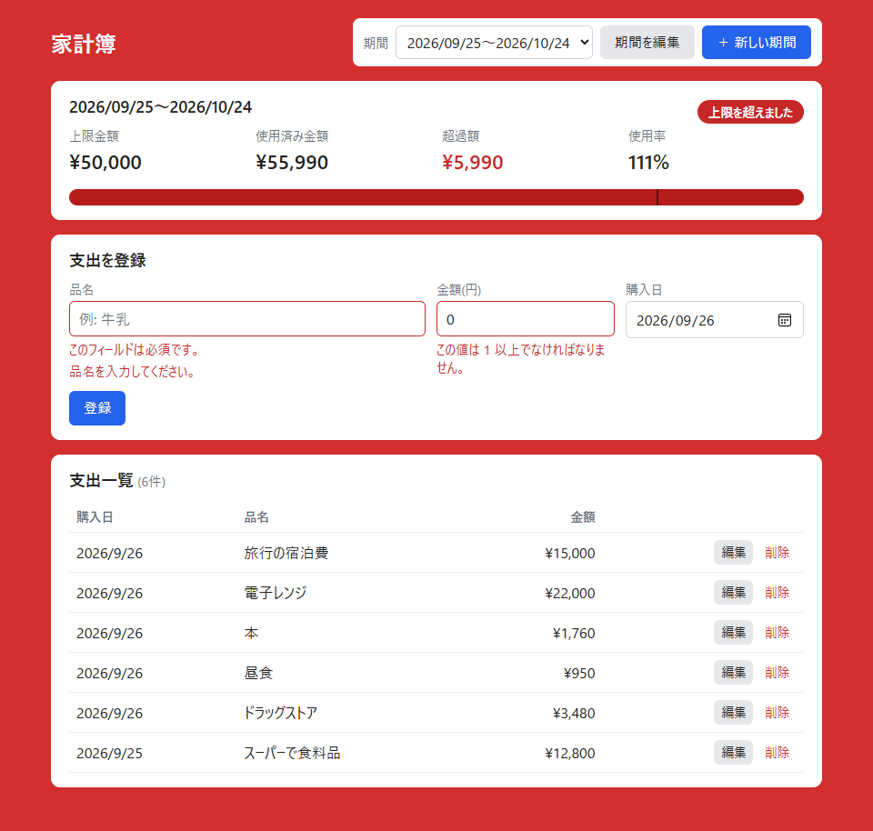
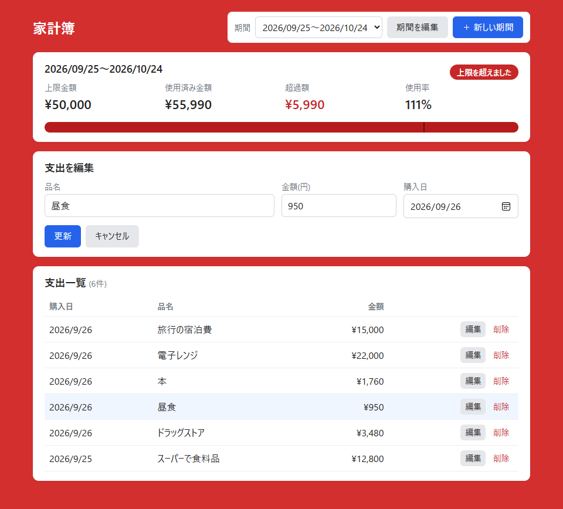

# first-study_Beginner 家計簿アプリ

学習用に作成する、個人利用向けのシンプルな家計簿アプリです。

期間(開始日〜締め日)ごとに使える金額の上限を決め、購入した物と金額を記録していくことで、
予算内に収まっているかを一目で確認できます。上限に近づくと画面の背景が赤くなって知らせます。

> 必須機能の実装と、AWS(EC2 + RDS)へのデプロイまで完了しています。

## 主な機能

- 開始日・締め日を設定して、予算を管理する期間を作成
- 期間ごとの上限金額(予算)の設定
- 購入した物と金額の入力・一覧表示・編集・削除
- 上限金額・使用済み金額・残り金額・使用率の表示
- 使用率が 80% 以上になると背景が赤くなり、上限を超えるとさらに濃い赤で警告

詳細は [要件定義書 (REQUIREMENTS.md)](REQUIREMENTS.md) を参照してください。

## 画面(動作確認)

AWS(EC2 + RDS)上で動作しているアプリを操作して撮影した画面です。上限金額 50,000円の期間に支出を登録していき、使用率に応じて背景色が切り替わることを確認しています。

### 1. 期間が未設定のとき

最初に期間の設定を促します。

### 2. 期間の設定

開始日・締め日・上限金額を入力します。

### 3. 予算内(使用率 80% 未満)

背景は通常の色です。上限金額・使用済み金額・残り金額・使用率を表示し、プログレスバーの縦線は警告ライン(80%)を表します。

### 4. 上限に近づいたとき(使用率 80% 以上)

背景が薄い赤になり、「上限に近づいています」と表示されます。

### 5. 上限を超えたとき(使用率 100% 超)

背景が濃い赤になり、「残り金額」の代わりに「超過額」を表示します。

### 6. 入力エラー

品名が未入力、金額が 0円などの不正な入力は登録せず、エラーメッセージを表示します。

### 7. 支出の編集

一覧の「編集」を押すと、入力欄に現在の値が入った状態で編集できます。編集中の行は色が変わります。

## 技術スタック

| 区分 | 技術 |
|---|---|
| バックエンド・フロントエンド | Python 3.13 + Django 5.2(Djangoテンプレートで画面を生成)、HTML/CSS |
| DB | MySQL 8.4(本番は Amazon RDS for MySQL、ローカルは Docker Compose) |
| Web・アプリケーションサーバー | Nginx + Gunicorn |
| インフラ | AWS(EC2 + RDS)、Terraform |

- RDS はプライベートサブネットに配置し、EC2 からのみ接続できるようにします
- アプリにログイン機能がないため、EC2 へのアクセスは自分のIPアドレスからのみ許可します

詳細は要件定義書の「3. 技術方針」を参照してください。

## ディレクトリ構成

| パス | 内容 |
|---|---|
| `config/` | Djangoプロジェクトの設定(`settings.py`・URL定義など) |
| `budget/` | 家計簿アプリ本体 |
| `budget/models.py` | 期間・支出のデータと、予算状況の計算 |
| `budget/forms.py` | 入力フォーム(期間・支出) |
| `budget/views.py` / `budget/urls.py` | 画面の処理とURL |
| `budget/templates/budget/` | 画面のHTML(Djangoテンプレート) |
| `budget/static/budget/` | CSS・JavaScript |
| `budget/tests.py` / `budget/test_views.py` | テスト(モデル / 画面) |
| `infra/` | AWS(VPC・EC2・RDS)を構築する Terraform のコード |
| `infra/templates/user_data.sh.tftpl` | EC2の初回起動時に実行するセットアップスクリプト |
| `docker-compose.yml` | ローカル開発用の MySQL |
| `docker/mysql/initdb/` | MySQL の初回起動時に実行するスクリプト(テスト用DBの権限付与) |
| `.env.example` | 設定ファイル `.env` のひな形(`.env` 自体はGitに含めない) |
| `requirements.txt` | 必要なPythonパッケージの一覧 |
| `prototype/` | 要件確認用のプロトタイプ |
| `docs/images/` | README に掲載している画面のスクリーンショット |

## ドキュメント

| ドキュメント | 内容 |
|---|---|
| [REQUIREMENTS.md](REQUIREMENTS.md) | 要件定義書(機能・技術方針・インフラ構成・データ項目・画面構成・スコープ外) |
| [prototype/](prototype/README.md) | 要件確認用のプロトタイプ(HTML・CSS・JavaScript) |
